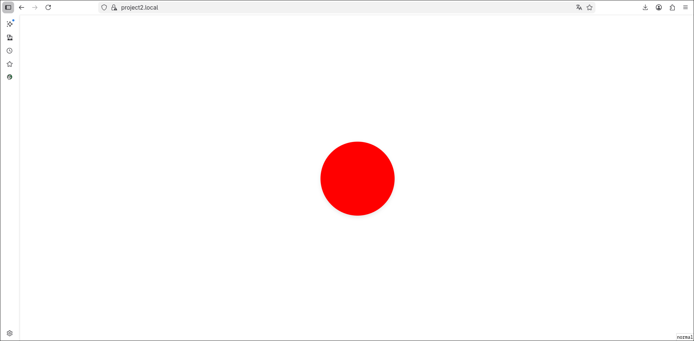
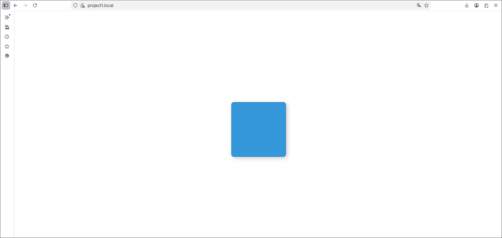

сначала установим и запустим nginx:

```
sudo pacman -S nginx
sudo systemctl start nginx
```

так как мы хотим пользоваться https, то надо сгенерировать (или можно было взять c Let's encrypt как понял позже):

```
sudo mkdir -p /etc/nginx/ssl
sudo openssl req -x509 -nodes -days 365 -newkey rsa:2048 \
    -keyout /etc/nginx/ssl/nginx-selfsigned.key \
    -out /etc/nginx/ssl/nginx-selfsigned.crt
```

тепер надо придумать содержимое наших "pet" проектов:
проект 1:

```
<!DOCTYPE html>
<html lang="ru">
<head>
    <meta charset="UTF-8">
    <meta name="viewport" content="width=device-width, initial-scale=1.0">
    <title>Фигура 1: Синий квадрат</title>
    <style>
        body {
            margin: 0;
            padding: 0;
            height: 100vh;
            display: flex;
            justify-content: center;
            align-items: center;
            background-color: white;
        }

        .square {
            width: 200px;        
            height: 200px;        
            background-color: #3498db;
            border-radius: 10px;
            box-shadow: 5px 5px 15px rgba(0, 0, 0, 0.2);
            border: 2px solid #2980b9;
        }
    </style>
</head>
<body>
    <div class="square"></div>
    <!-- Простой div с классом square -->
</body>
</html>
```

проект 2:

```
<!DOCTYPE html>
<html lang="ru">
<head>
    <meta charset="UTF-8">
    <meta name="viewport" content="width=device-width, initial-scale=1.0">
    <title>Фигура 2: Красный круг</title>
    <style>
        body {
            margin: 0;
            padding: 0;
            height: 100vh;
            display: flex;
            justify-content: center; 
            align-items: center;
            background-color: white;
        }

        .circle {
            width: 200px;
            height: 200px;
            background-color: red;
            border-radius: 50%;
            box-shadow: 0 4px 10px rgba(0, 0, 0, 0.1);
        }
    </style>
</head>
<body>
    <div class="circle"></div>
    <!-- Простой div с классом circle, который стилизуется выше -->
</body>
</html>
```

распологаться они будут по пути:

```
/var/www/project_name/
```

теперь самое интересное - конфиг nginx'а:

```
server {
    listen 80;
    server_name project1.local www.project1.local;
    return 301 https://$server_name$request_uri;
}

server {
    listen 443 ssl;
    server_name project1.local www.project1.local;

    ssl_certificate /etc/nginx/ssl/nginx-selfsigned.crt;
    ssl_certificate_key /etc/nginx/ssl/nginx-selfsigned.key;

    root /var/www/project1;
    index index.html;

    # Алиас для другого пути
    location /images/ {
        alias /var/www/project1/pics/;
    }

    location / {
        try_files $uri $uri/ =404;
    }
}
```

располагается по пути:

```
/etc/nginx/sites-available/
```

конфиг для второго проекта аналогичный.
теперь надо изменить файл ```/etc/nginx/nginx.conf```, а именно включим туда наши конфиги, добавим в секцию ```http``` строчку ```include /etc/nginx/sites-enabled/*```
затем активируем наши виртуальные хосты:

```
sudo ln -s /etc/nginx/sites-available/project1.conf /etc/nginx/sites-enabled/
sudo ln -s /etc/nginx/sites-available/project2.conf /etc/nginx/sites-enabled/
sudo nginx -t  # проверить синтаксис
sudo systemctl reload nginx
```

результат:





P.S:
при первом заходе на каждую из страниц был warning от браузера, о том что он не доверяет самописному сертификату, но он там же предлагает добавить в исключения и всё потом работает)
и еще сертификат навайбил чутка)
и самое главное благодаря лабе научился на своей системе делать скрины)))))
