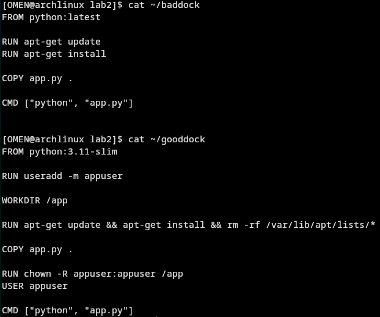
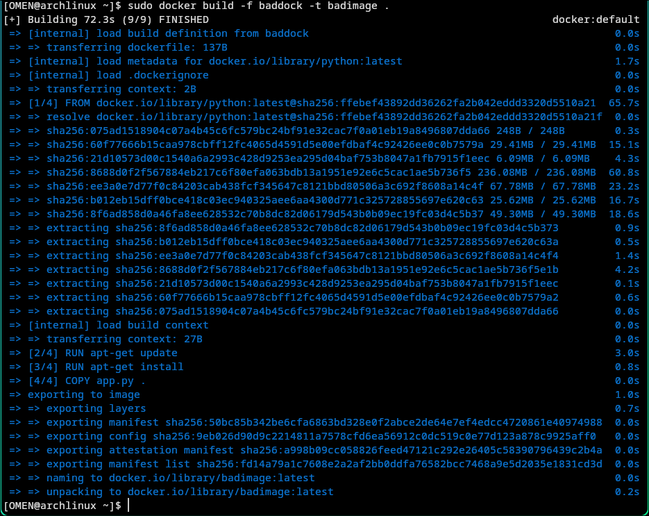
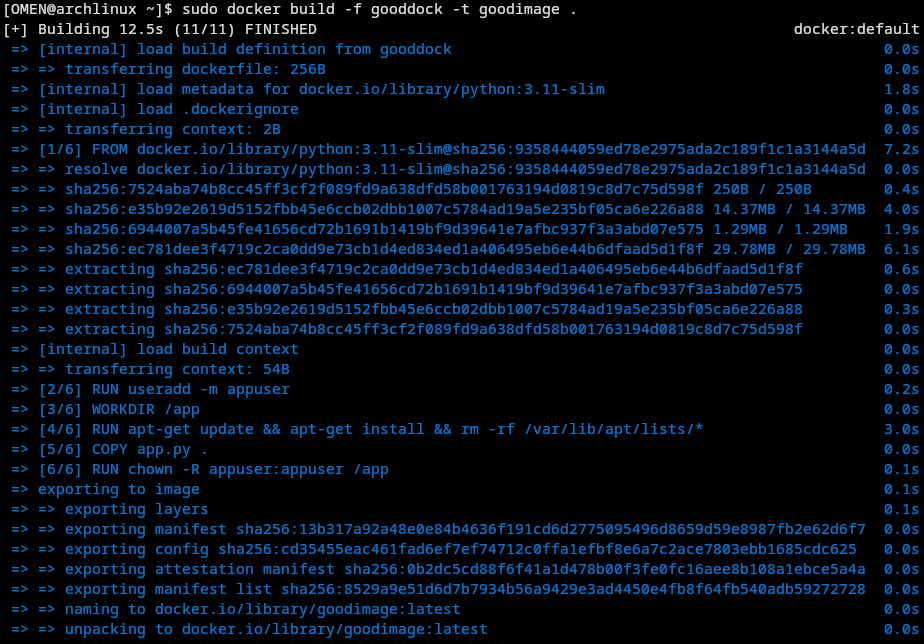
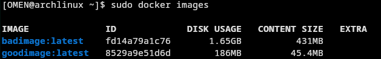
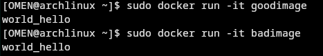

# плохие практики в docker-files

1. использование latest: в новых версиях зависимости имеют свойство ломаться, к тому же последния версия не значит стабильная, к тому же необходимый нам "функционал" может отсутствовать или быть изменен.

2. не использовать .dockerignore: если у нас появились промежуточные файлы в ходе сборки, то они останутся в демоне.

3. установка ненужных пакетов: очевидная вещь, но часто мы добавляем что-то, что возможно пригодится или делаем это на автомате.

4. не чистить кэши: просто в конце каждого run'а чистим кэши и образ будет меньше.

5. множественные run'ы: каждый run - новый слой. если совместить в один, то образ будет меньше.

## практика практик плохих и хороших

### установка:

```bash
sudo pacman -S docker 
sudo pacman -S docker-buildx
```

### старт:

```bash
sudo systemctl start docker
```

### docker-files:



### build:

```bash
sudo docker build -f gooddock -t goodimage .
sudo docker build -f baddock -t badimage .
```

сразу видна разница в скорости сборки





не трудно заметить разницу в размерах образов



хотя они делают то же самое


