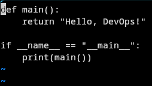
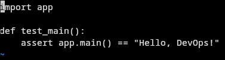
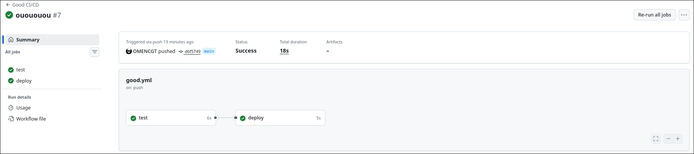
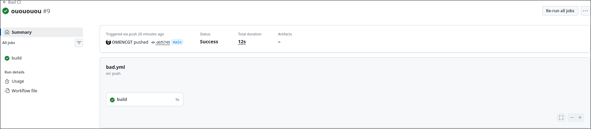

# Плохие практик ci/cd

для всех этих дел был создан маленьки публичный [репчик](https://github.com/OMENCGT/ci-cd) 

там есть ```app.py```:



и еще ```test_app.py```:



а еще там есть черненький чумазенький ```bad.yml```:

```yml
name: Bad CI
on: [push, pull_request]
jobs:
  build:
    runs-on: ubuntu-latest
    steps:
      - uses: actions/checkout@v1
      - name: Setup Python
        run: sudo apt-get install python3 python3-pip -y
      - name: Install dependencies
        run: pip3 install pytest
      - name: Run tests
        run: pytest test_app.py
      - name: Deploy (fake)
        run: echo "Deploying..."
```

и его чистенький брат ```good.yml```:

```yml
name: Good CI/CD

on:
  push:
    branches: [ main ]
  pull_request:
    branches: [ main ]

jobs:
  test:
    runs-on: ubuntu-22.04
    steps:
      - uses: actions/checkout@v4

      - name: Set up Python
        uses: actions/setup-python@v5
        with:
          python-version: '3.11'

      - name: Install dependencies
        run: |
          pip install --upgrade pip
          pip install pytest

      - name: Run tests
        run: pytest test_app.py

  deploy:
    needs: test
    runs-on: ubuntu-22.04
    if: github.ref == 'refs/heads/main'
    steps:
      - uses: actions/checkout@v4
      - name: Deploy
        run: echo "Deploying only if tests passed on main"
```

### разговор о важном:

тут уже все видно, но было сделано не все что можно.

1. опять этот ```latest```... лучше не пихать его куда попало, хотя тут ок.

2. не пихать в 1 job все что видите. разбить на насколько куда удобнее, ведь мы можем выбрать какие этапы должны быть пройдены до этого. в плохом варианте грубо говоря будет ```deploy``` даже без пройденных тестов.

3. тут все проименовано, но очень стоит именовать ваши действия, чтобы понимать где вы упали.

4. а ну чтобы все работало быстрее - кэшируйтесь по возможности.

### так что там с сияй/сиди:

вот так как то:





# конец

мне вообще нравится эта штука, запушил сидишь пьешь водичку а оно само всё тестится - очень круто.


